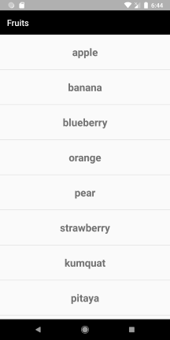
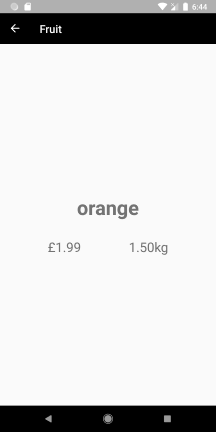
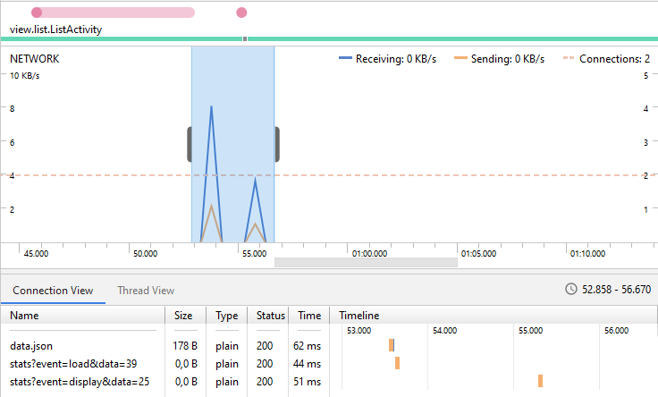

# Fruit exercise

Minimalistic app that lists fruits. If one is tapped, a new page displays price and weight. The data is refreshable by scrolling up. 

 

## 📐 Architecture

The app was written in Kotlin and implements MVVM. It uses multiple Jetpack components, such as: Data Binding, LiveData, ViewModel etc. 

The navigation was handled with the Navigation component, which eases replacing fragments, handling transitions, passing data to Fragments etc.

The data in the software is handled through Repository Pattern, creating a single / clear entry point for data management, specifically, the network operations are executed by Coroutines. 

The dependencies are injected manually. 

## 📈 Analytics

I assumed analytics calls don't have to be measured. 

I've used the Profiler to make sure that when downloading the fruit list, the analytics call follows right after, in order to report the time it took. The image also shows the analytics for the loading time. The analytics for the error reporting works when an application level crash occurs and can also be manually used when managed exceptions rise.

 

## ⌨️Libraries

- [Retrofit](https://github.com/square/retrofit)
- [LiveData](https://developer.android.com/topic/libraries/architecture/livedata)
- [Coroutines](https://developer.android.com/kotlin/coroutines)
- [Data Binding](https://developer.android.com/topic/libraries/data-binding)
- [Navigation](https://developer.android.com/guide/navigation)

## 📈 Future improvements

* Consider using a Dependency Injection library (e.g. [Dagger 2](https://github.com/google/dagger)) if the project grows
* Consider using Paging if the fruit list grows
* Use Build Flavours to specify different APIs
* Add tablet designs
* Definitely add more details to the fruit entries ! 